# Section 0: Introduction to the workshop
```
0.1: Introduction to the workshop
0.2: Knowledge prerequisites
0.3: What this workshop is NOT about
0.4: Lab graphics
0.5: If something goes wrong
0.6: Preparing to do the lab
0.7: Accessing the lab for the first time
```

# 0.1 Introduction to the workshop 
This workshop teaches advanced Ansible automation techniques for managing networking, meaning, switches and routers mainly.
This lab is based on [https://containerlab.dev/](https://containerlab.dev), which will allows us to spin up different container based [Arista](https://www.arista.com) environments.

A lot of the workshop material is inspired from:
* [Arista Ansible getting started](https://arista.my.site.com/AristaCommunity/s/article/arista-ansible-getting-started)
* [David Varnum's Arista BPG EVPN Configuration Example](https://overlaid.net/2019/01/27/arista-bgp-evpn-configuration-example/)
* [Dharmesh Shah's and Dave Varnum's Arista BGP EVPN ContainerLab configs](https://clabs.netdevops.me/rs/arista-bgp-evpn/)

This workshop uses Arista cEOS, because it is so very easy to work with. If you are using Cisco, Arista will feel very familiar, most commands are similiar between the two.

# 0.2 Knowledge prerequisites
This work assumes a few things from the student of the workshop, such as:
* The person has intermediate knowledge about Ansible
* You have basic knowledge of how to navigate and edit files in a Linux shell.
* The person has intermediate to expert knowledge about networking, more specific, about switching and routing (level 2 to 5).

# 0.3: What this workshop is NOT about
This workshop will not explain networking concepts. This is not a workshop which attempts to teach networking, routing or switching.

How to implement network automation for production environents, which includes an enterprise framework such as Ansible Automation Platform.

This workshop neither tries to explain the basics of Ansible, you are expected to understand what roles, playbooks, collections, variables, inventories are and know the differences between the different Ansible CLI and management tools such as Ansible Automation Platform.

# 0.4 Lab graphics

In this lab, we use some basic graphics to make the lab easier to understand. Such as:

:boom: This is something which you have to do.
:star: If you have time, you can also do this.
:exclamation: Take careful notice of this, or you may fall on your face.
:unlock: Show solution
:thumbsup: This text contains information about a best practice.
```
Here is some code that you need to run
```
```
Here is an example of expected output when running commands
```

# 0.5: :exclamation: If something goes wrong
If by some reason you get stuck in a lab - then here's what you should do. **Follow below steps 1-5**. _Do not skip any steps if not told to._

1. If you do not understand what to do in a lab, or do not understand what you are doing, skip immediately to step 5. Also, the authors of this lab apologize for that. The purpose of this lab is so that everyone can do it and understand it.
2. This lab has seen plenty of use, so chances are that you have simply not followed the lab instructions. Start by reading the lab instructions again, carefully.
3. If you are sure that you are doing things as described in the labs, perhaps you typed something wrong or had a copy-paste accident. Double checking your files content and comparing them with the content described here in the lab. If you typed things manually, try doing a clean copy-paste from the lab page instead.
4. There are solutions documented in the labs/lab-1/solutions and labs/lab-2/solutions directories which containers playbooks, variable files, etc, which you can compare with. 
5. Ask the person beside you if that person also had an issue with what you are doing. If so, that may indicate there is actually something wrong.
6. If you are doing this as a part of teacher lead workshop. Raise your hand and someone will come and help you... Otherwise, find the issue, and contribute a fix. You can do it.

# 0.6 Preparations to do the lab

:exclamation: To get started with the labs, you first need to get your assigned username and servers. This will be provided to you by the people who operate this lab. If you have deployed the lab yourself, well, then you know where to login. 

:exclamation: Do not skip any labs, the labs depend on the previous ones to be completed. You need to do them in sequencial order.

:exclamation: On purpose, security in this lab has not been made a priority, that is so you as a student get more freedom to learn. You have passwordless admin access on all systems. With that said, if you do something which is outside of the labs and break your systems, _you get to keep all the pieces_ ;) 

:boom: Make sure you have the required tools to do the lab. The tools are listed below:
* A web browser (to view this page and the code-server / terminal).

:exclamation: The systems you will be working on runs Red Hat Enterprise Linux 9.4, if you are new to Linux, see below for a simple guide for common commands: 
* **Linux cheat sheet**: https://files.fosswire.com/2007/08/fwunixref.pdf

:exclamation: If you edit files in the terminal, you have to use one of the text based text editors (nano, vim, emacs, joe) available.
Use below links as reference when needed. For now, continue on:
* **nano**: https://wiki.gentoo.org/wiki/Nano/Basics_Guide
* **vi/vim**: https://vim.rtorr.com/ 
* **emacs** Congratulations, you obviously know what you are doing already

# 0.7 Accessing the lab for the first time

1. Ensure you have received an URL which you access the lab using your web browser. Please note. This lab has been tested using Chrome and Firefox. If you use anything else, you are on your own.

2. Open up your web browser and access the web based Visual Studio code environment, as shown below and enter in the workshop password.
The workshop password is _rhadvnetworkshop2024_
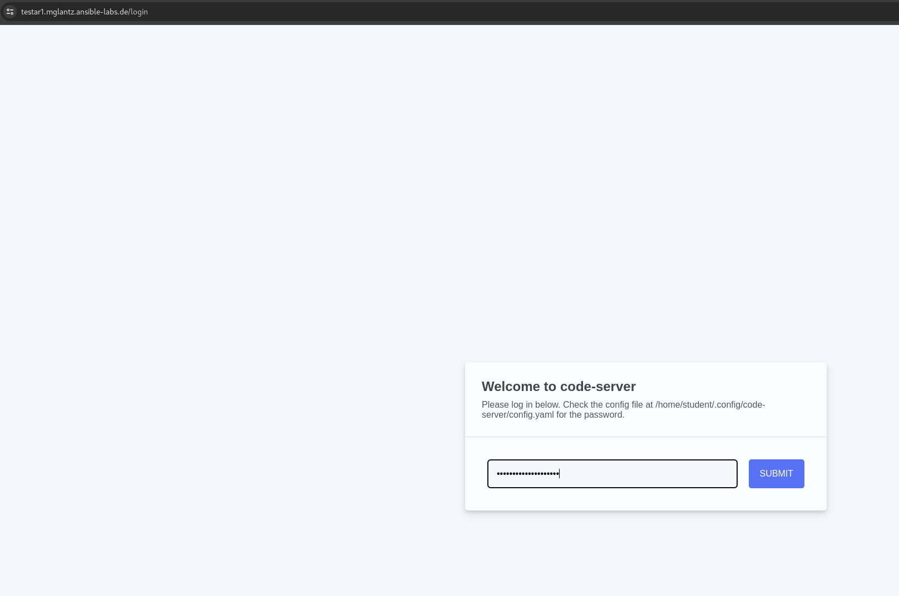

3. Next, you select a visual theme and also ensure to click on "Rich support for all your language". After that click "Mark as done".
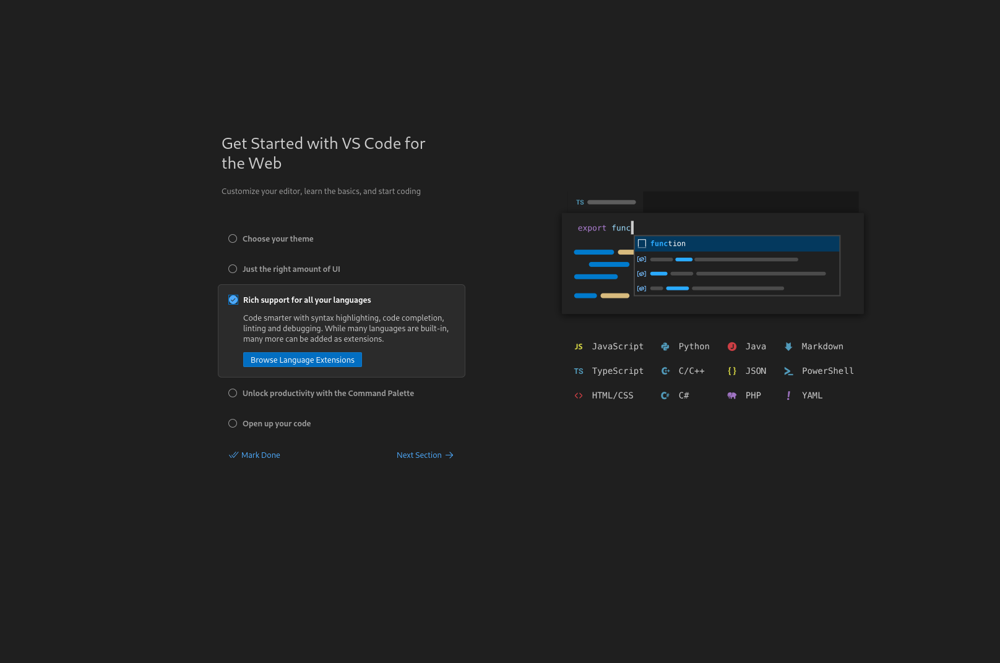

4. Now we will install the Ansible extention as well. Click on the three stripes on the left hand side menu and select View > Extentions.
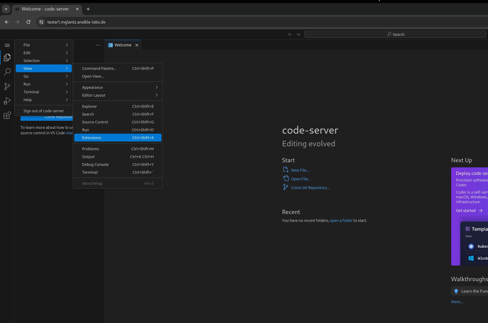

5. Type in "ansible" in the search field and click "Install" on the one labeled _redhat_.
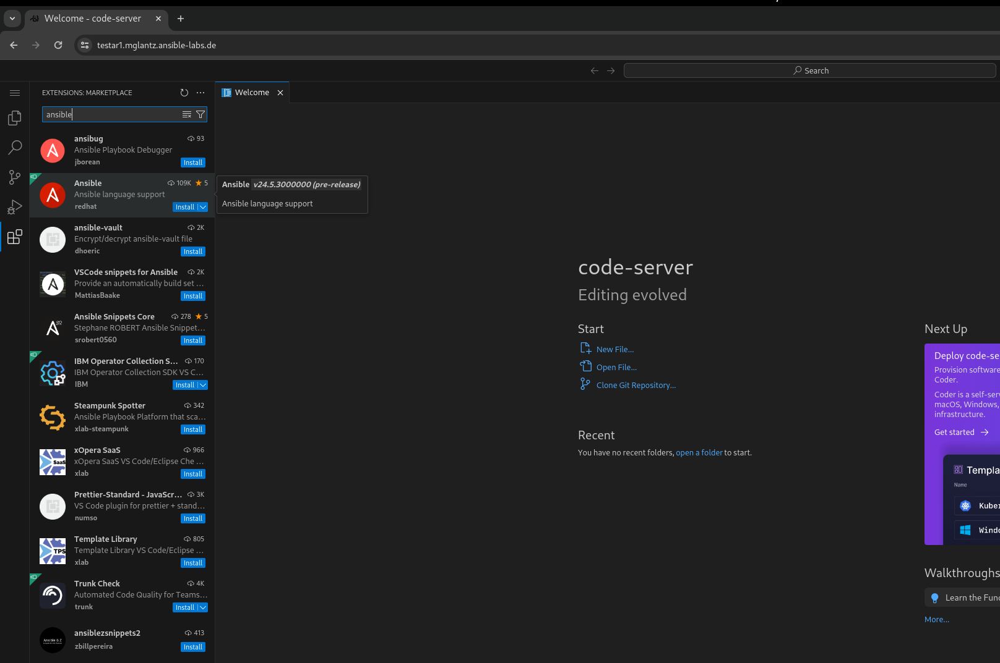

6. Validate that once the Ansible extension has been installed - it look as below.
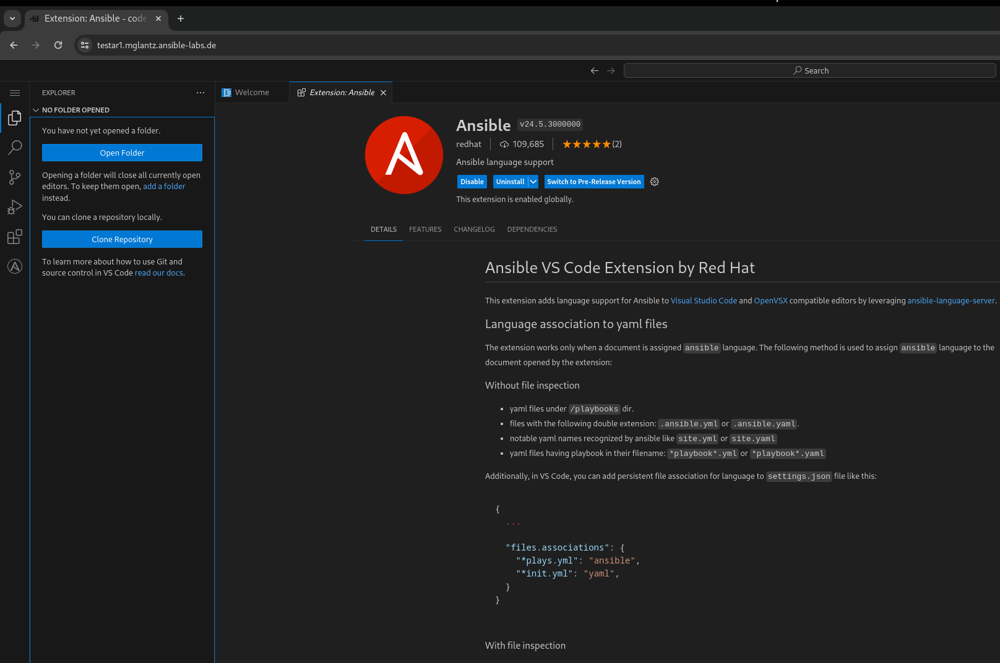

7. Next, click on the left hand side menu item symbolized by two documents, and select "Open Folder". Then select "/home/student/advanced-networking-workshop" in the windows which opens in the middle of the window and click on "OK".
This is where you can browse files in the lab.
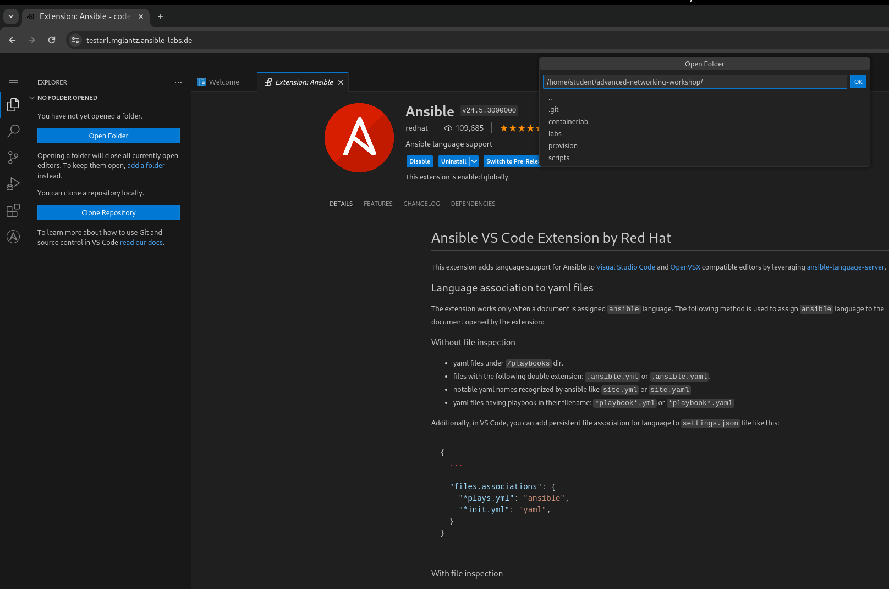

8. Select "Yes, I trust the authors" to if you want to do that.
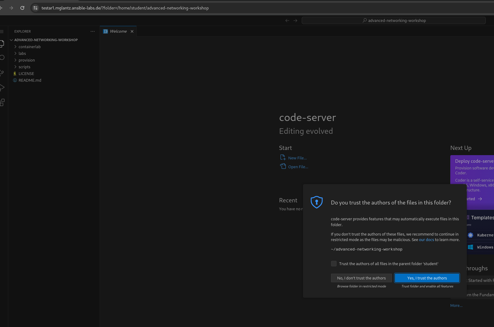

9. You create new files by clicking on the "New file" symbol with a + superimposed over a document. Remember this for when you are asked to create files during the lab.
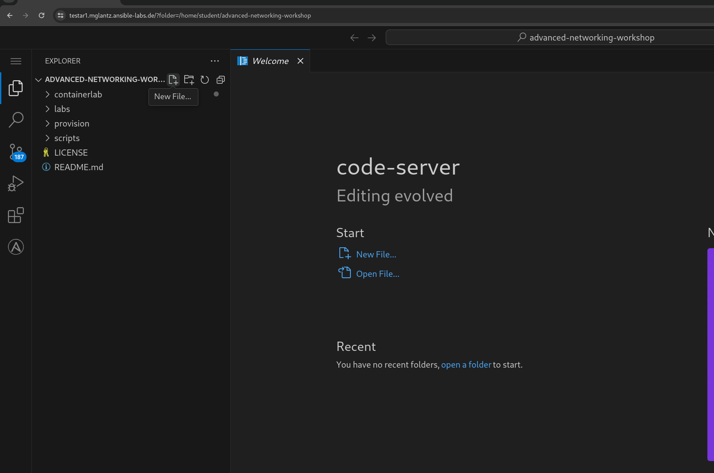

10. Observe how files opened or created appears as separate tabs, just like in a web browser.
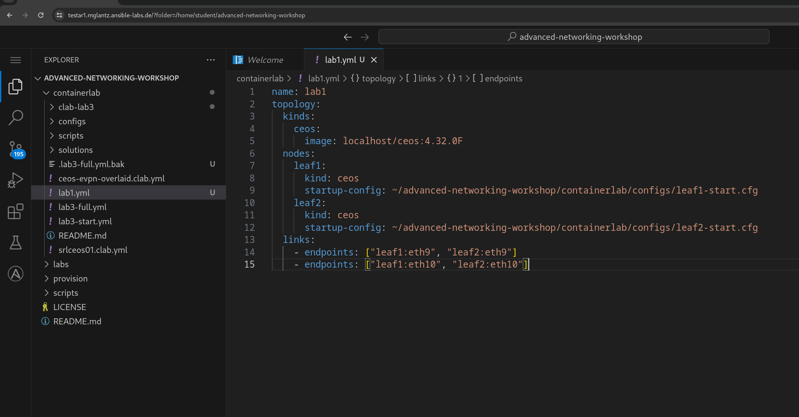

11. Finally, we will open up a terminal to the underlying Linux operating system. Click on the three stripes on the top of the left hand side menu, then: Terminal > New Terminal.
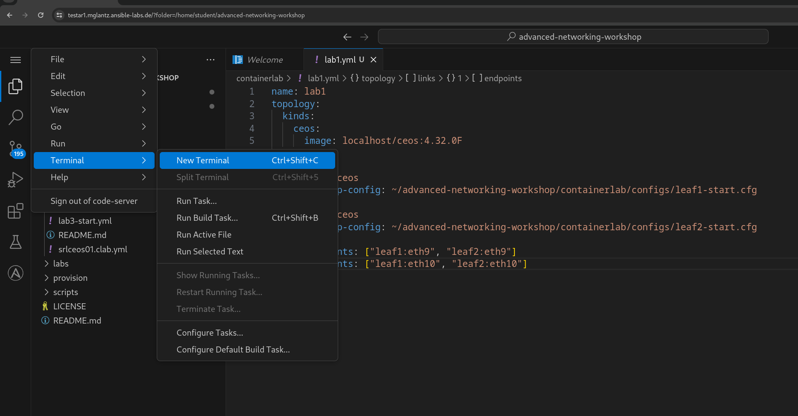

12. Please observe that if you are asked to run commands during the lab, this is where that happens. As shown below. Also observe that you can adjust how large part the various things in the browser (file browser, open files and the terminal) takes up.
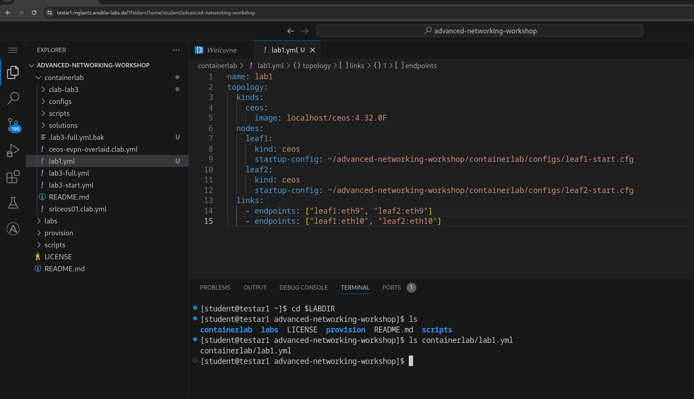

You are now done with the introduction to the lab and are ready to start learn about advanced networking automation using Ansible.

```
End-of-lab
```
[Go to the next lab, lab 1](../lab-1/README.md)


