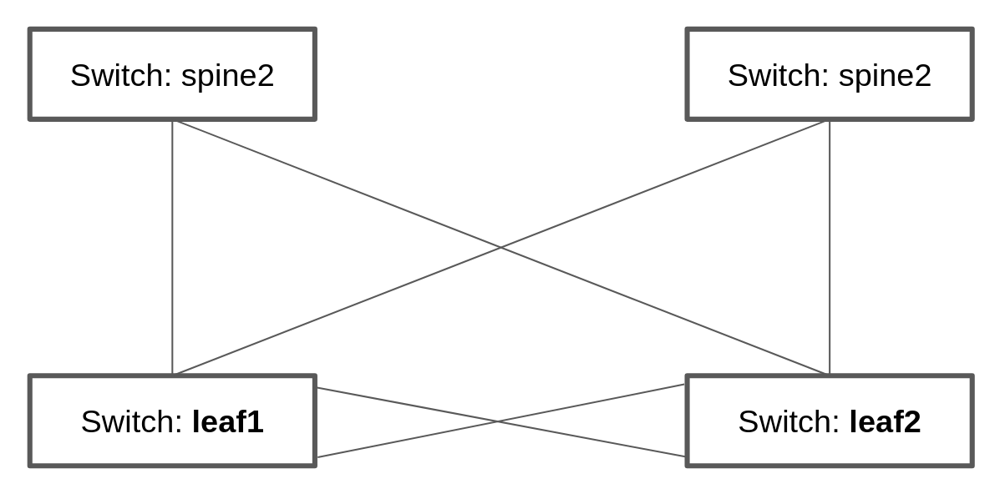
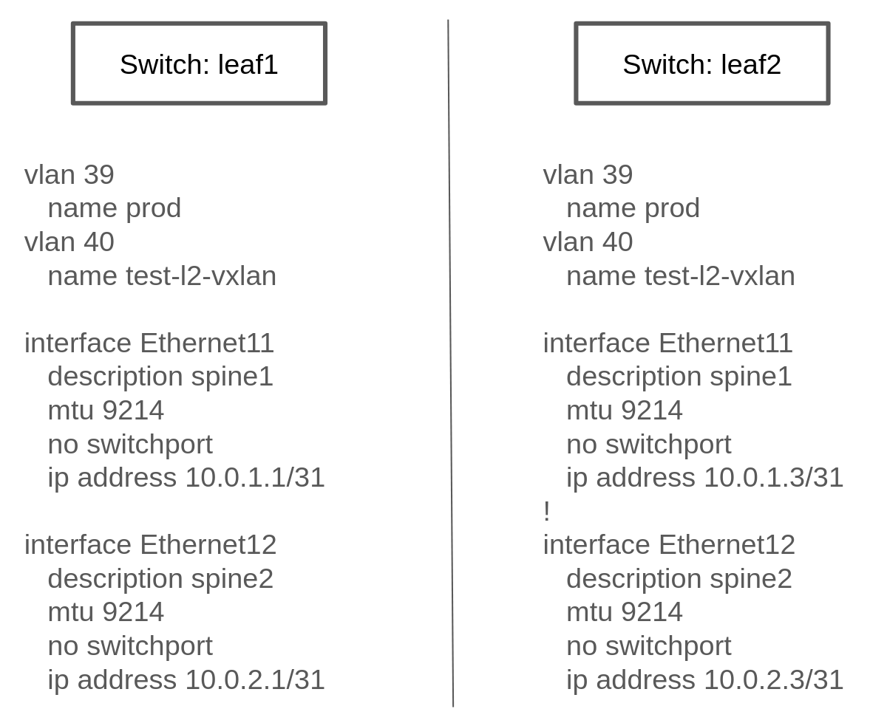

# Section 2: Fundamentals, test automation, information related tasks
In this section, you will focus on different approaches to configuring your network devices.
At the end of this section, you will have learned about the three main approaches to applying configuration changes to devices, using Ansible.

## Overview
This is what we will learn about in this first section of the workshop.

```
2.1 Building a new containerlab environment
2.2 Reviewing the initial desired configuration state
2.3 Using the command module to accomplish our desired state
2.3.1 Assessing the use of the command module.
2.4 Learning about purpose specific configuration modules
2.4.1: module state: "merged" (often the default)
2.4.2: module state: "replaced"
2.4.3: module state: "overridden"
2.4.4: module state: "deleted"
2.4.5: module state: "gathered"
2.4.6: module state: "rendered" / "parsed"
2.5 Reset your lab environment
2.6 Using purpose specific modules to archieve the desired configuration state
2.6.1 Assessing the use of purpose specific configuration modules
2.7 Using config modules to make changes
2.7.1 Using the config module to load static config files into devices
2.7.2 Using the config module to inject lines of config into devices
2.7.3 Using the config module to load dynamic config files into devices
```
## 2.1 Building a new containerlab environment
Before we get started with configuring our switches, we need to build a new containerlab environment. This time, it will include some more switches in a traditional leaf-spine setup. As such:



This means you will need to create a new containerlab topology file, which creates a setup with the spine switches in place as well.

:boom: Task 0: Before you create the new setup, let's destroy the previous environment. You do that by runing below commands:
```
cd $LABDIR/containerlab
sudo containerlab --runtime podman destroy -t lab1.yml
```

Expected output is:
```
$ sudo containerlab --runtime podman destroy -t lab1.yml
INFO[0000] Parsing & checking topology file: lab1.yml   
INFO[0000] Destroying lab: lab1                         
INFO[0010] Removing containerlab host entries from /etc/hosts file 
INFO[0010] Removing ssh config for containerlab nodes 
```

:boom: Task 1: Create a new containerlab topology file, which reflects above setup. Also, more specifically:
* Save your work in a the containerlab dictory and name the file lab1.yml
* You should have two Arista cEOS switches which are connected to each other, as follows:
* kinds: should be ceos and image needs to be set to: localhost/ceos:4.32.0F
* Call your nodes: leaf1, leaf2, spine1, spine2
* The leaf switches should be connected to each other via ports eth9 on and eth10 (leaf1:eth9 to leaf2:eth9 and leaf1:eth10 to leaf2:eth10).
* The leaf switches should be connected to the spine switches as such: leaf1:eth11 to spine1:eth1, leaf1:eth12 to spine2:eth1. AND leaf2:eth11 to spine1:eth2 and leaf2:eth12 to spine2:eth2.
* startup-config should be ~/advanced-networking-workshop/containerlab/configs/leaf1-start.cfg for leaf1 and leaf2-start.cfg for leaf2.
* startup-config should be ~/advanced-networking-workshop/containerlab/configs/spine1-start.cfg for spine1 and spine2-start.cfg for spine2.

<details>
<summary>:unlock: Show example solution: Task 1</summary>
<p>
  
```
name: lab2
topology:
  kinds:
    ceos:
      image: localhost/ceos:4.32.0F
  nodes:
    leaf1:
      kind: ceos
      startup-config: ~/advanced-networking-workshop/containerlab/configs/leaf1-start.cfg
    leaf2:
      kind: ceos
      startup-config: ~/advanced-networking-workshop/containerlab/configs/leaf2-start.cfg
    spine1:
      kind: ceos
      startup-config: ~/advanced-networking-workshop/containerlab/configs/spine1-full.cfg
    spine2:
      kind: ceos
      startup-config: ~/advanced-networking-workshop/containerlab/configs/spine2-full.cfg
  links:
    - endpoints: ["leaf1:eth9", "leaf2:eth9"]
    - endpoints: ["leaf1:eth10", "leaf2:eth10"]
    - endpoints: ["leaf1:eth11", "spine1:eth1"]
    - endpoints: ["leaf1:eth12", "spine2:eth1"]
    - endpoints: ["leaf2:eth11", "spine1:eth2"]
    - endpoints: ["leaf2:eth12", "spine2:eth2"]
```
</p>
</details>

---

:boom: Task 2: Now it's time to rebuild the lab environment to our new setup. Use the "sudo containerlab" command like you did before, but add a --reconfigure flag at the end.

<details>
<summary>Show example solution: Task 2</summary>
<p>

```
$ cd $LABDIR/containerlab
$ sudo containerlab --runtime podman deploy -t lab2.yml --reconfigure
INFO[0000] Containerlab v0.54.2 started                 
INFO[0000] Parsing & checking topology file: lab2.yml   
INFO[0000] Destroying lab: lab2                         
INFO[0011] Removing containerlab host entries from /etc/hosts file 
INFO[0011] Removing ssh config for containerlab nodes   
INFO[0011] Removing /home/mglantz/advanced-networking-workshop/containerlab/clab-lab2 directory... 
INFO[0011] Creating lab directory: /home/mglantz/advanced-networking-workshop/containerlab/clab-lab2 
INFO[0011] Running postdeploy actions for Arista cEOS 'leaf1' node 
INFO[0012] Created link: leaf1:eth9 <--> leaf2:eth9     
INFO[0012] Created link: leaf1:eth11 <--> spine1:eth1   
INFO[0012] Created link: leaf1:eth10 <--> leaf2:eth10   
INFO[0012] Created link: leaf1:eth12 <--> spine2:eth1   
INFO[0012] Running postdeploy actions for Arista cEOS 'spine1' node 
INFO[0012] Running postdeploy actions for Arista cEOS 'spine2' node 
INFO[0012] Created link: leaf2:eth11 <--> spine1:eth2   
INFO[0012] Created link: leaf2:eth12 <--> spine2:eth2   
INFO[0012] Running postdeploy actions for Arista cEOS 'leaf2' node 
INFO[0032] Adding containerlab host entries to /etc/hosts file 
INFO[0032] Adding ssh config for containerlab nodes     
+---+------------------+--------------+------------------------+------+---------+------------------+-----------------------+
| # |       Name       | Container ID |         Image          | Kind |  State  |   IPv4 Address   |     IPv6 Address      |
+---+------------------+--------------+------------------------+------+---------+------------------+-----------------------+
| 1 | clab-lab2-leaf1  | c43beb6f5075 | localhost/ceos:4.32.0F | ceos | running | 172.20.20.156/24 | 2001:172:20:20::9c/64 |
| 2 | clab-lab2-leaf2  | a6d369a8cb7a | localhost/ceos:4.32.0F | ceos | running | 172.20.20.157/24 | 2001:172:20:20::9d/64 |
| 3 | clab-lab2-spine1 | 9aac98d43532 | localhost/ceos:4.32.0F | ceos | running | 172.20.20.158/24 | 2001:172:20:20::9e/64 |
| 4 | clab-lab2-spine2 | b029cb180307 | localhost/ceos:4.32.0F | ceos | running | 172.20.20.159/24 | 2001:172:20:20::9f/64 |
+---+------------------+--------------+------------------------+------+---------+------------------+-----------------------+
```

```
End of solution: Task 2
```
</p>
</details>

Now that we have a new lab environment, we need to re-generateour Ansible inventory as well.

---

:boom: Task 3: Run below command to generate a new Ansible inventory and accept SSH keys for your systems.
```
$ cd $LABDIR
$ scripts/ansible_hosts.sh lab2
```

---

:boom: Task 4: Validate that the inventory was generated corrected using the cat command.
```
$ cd $LABDIR 
$ cat inventory
```
<details>
<summary>:unlock: Show example output: Task 4</summary>
<p>

```
$ cd $LABDIR
$ cat inventory 
[all:vars]
# common variables
ansible_user=admin
ansible_ssh_private_key_file=~/.ssh/advanced-networking-workshop_id_rsa
ansible_network_os=arista.eos.eos
ansible_connection=ansible.netcommon.network_cli

[leafs]
clab-lab2-leaf1 ansible_host=172.20.20.153
clab-lab2-leaf2 ansible_host=172.20.20.155

[spines]
clab-lab2-spine1 ansible_host=172.20.20.152
clab-lab2-spine2 ansible_host=172.20.20.154

[switches:children]
leafs
spines
```

```
End of example output: Task 4
```
</p>
</details>

Well done, now we are ready to do some configuration of our switches.

## 2.2 Reviewing the initial desired configuration state
First off, as we learn the different main approaches to doing configuration management, we will keep the desired configuration state simple.
Don't worry, once you have learned these basics, you will get to work with more production like environments.



Above we can see what switch configuration we will start working with. It represents a commonality in most networks, which is that some configuration is static across devices and some varies across devices. In our example, the VLAN configuration is the same across our two leaf switches, while the Ethernet interface configuration is differs more between the two. As we review different approaches to applying configuration, you will find that some methods works better for different types of configuration (static vs unique).

In general you have four different main approaches you can select from when applying configuration to network devices:
1. Using the command module to send litteral cli commands (not recommended if it can be avoided).
2. Using Ansible specific modules to manage specific tasks such as VLAN configuration, interface configuration, etc.
3. Using a config module, to push specific static lines of configuration or dynamic lines of configuration using Ansible templating. 

To inform your choices, there are three main questions you can ask yourself:

1. What use-cases do I want to support? Examples:
* Reduced time to deliver - You want to be able to provide automatic network configuration associated with putting in place new servers and services. Focus will be all configuration required to establish a new environment for servers and services to live in. You probably will need to integrate with other solutions, such as IPAM solutions, etc.
* Increased delivery precision - You want configuration changes to be right from the start. To increase impact, you focus on the things which changes most or what things you most often get wrong.
* Infrastructure as Code (IaC) - as a part of a larger initiative, you deliver network configuration in an automatic fashion, scope for what you start focusing on gets dictated by the scope of your IaC project.
* Security - You deliver automation which supports security use-cases such as threat hunting (gathering information) and security incident management (isolating breaches, etc).
2. What configuration will you manage? (Considering the use-case(s)). What configuration will you need to manage with your automation and on what devices? It's here that you start diving into the nature of the related configuration, if it's static or dynamic across devices, networks, etc.
3. At what scale will you manage different types of configuration? If there is dynamic configuration across many devices to be dealt with, you will benefit more from approaches where you automatically generate configuring using templates for example. At the same time, creating unique static like definitions for each devices may no longer work.

Don't worry though, we will try out all the different methods, so you can decide yourself what works and what doesn't.

## 2.3 Using the command module to accomplish our desired state

We will start off trying out what in essence is a not-recommended approach to applying configuration changes - which is using the command module directly. The main reason why we cover it is because the command module to some is easier to understand, which may lure you to use it. We will see it's limitations on full display in this exercise.

:boom: Task 1: Create a playbook called cmd_config.yml which uses the arista.eos.eos_command module to accomplish below configuration for our leaf1 and leaf2 switches.
* :thumbsup: Hints:
1. Use host_vars variable files for the unique configuration.
2. You have to state "config" on a separate line before start feeding cli command input, just as you would do if you do this manually.

* Leaf1 desired state:
```
vlan 39
   name prod
vlan 40
   name test-l2-vxlan

interface Ethernet11
   description spine1
   mtu 9214
   no switchport
   ip address 10.0.1.1/31

interface Ethernet12
   description spine2
   mtu 9214
   no switchport
   ip address 10.0.2.1/31
```

* Leaf2 desired state:
```
vlan 39
   name prod
vlan 40
   name test-l2-vxlan

interface Ethernet11
   description spine1
   mtu 9214
   no switchport
   ip address 10.0.1.3/31
!
interface Ethernet12
   description spine2
   mtu 9214
   no switchport
   ip address 10.0.2.3/31
```

:exclamation: As there is not large value in learning how to use the command module to accomplish configuration changes, feel free to copy the solution below.

<details>
<summary>:unlock: Show example solution: Task 1</summary>
<p>

* Create a directory in $LABDIR called host_vars
```
$ cd $LABDIR
$ mkdir host_vars
```

* Create a host_vars/clab-lab2-leaf1 file which contains:
```
---
eth11_ip_address: "10.0.1.1/31"
eth12_ip_address: "10.0.2.1/31"
```

* Create a host_vars/clab-lab2-leaf2 file which contains:
```
---
eth11_ip_address: "10.0.1.3/31"
eth12_ip_address: "10.0.2.3/31"
```

* Create a playbook as such:
```
- name: "Apply static desired network configuration"
  hosts: leafs
  gather_facts: no
  become: yes
  tasks:
    - name: Apply VLAN 39 configuration
      arista.eos.eos_command:
        commands:
          - config
          - vlan 39
          - name prod

    - name: Apply VLAN 40 configuration
      arista.eos.eos_command:
        commands:
          - config
          - vlan 40
          - name test-l2-vxlan
         
    - name: Apply Ethernet11 configuration
      arista.eos.eos_command:
        commands:
          - config
          - int Ethernet11
          - description spine1
          - mtu 9214
          - no switchport
          - ip address {{ eth11_ip_address }}

    - name: Apply Ethernet12 configuration
      arista.eos.eos_command:
        commands:
          - config
          - int Ethernet12
          - description spine2
          - mtu 9214
          - no switchport
          - ip address {{ eth12_ip_address }}
```

```
End of solution: Task 1
```
</p>
</details> 

---

:boom: Task 2: Now, run the playbook and validate that the configuration state of the switches is correct using 'ssh admin@IP-OF-SWITCH' (password: admin).

<details>
<summary>:unlock: Show example solution: Task 2</summary>
<p>

```
$ cd $LABDIR
$ ansible-playbook -i inventory cmd_config.yml

PLAY [Apply static desired network configuration] ***********************************************************************************************************************************

TASK [Apply VLAN 39 configuration] **************************************************************************************************************************************************
[WARNING]: ansible-pylibssh not installed, falling back to paramiko
ok: [clab-lab2-leaf1]
ok: [clab-lab2-leaf2]

TASK [Apply VLAN 40 configuration] **************************************************************************************************************************************************
ok: [clab-lab2-leaf1]
ok: [clab-lab2-leaf2]

TASK [Apply Ethernet11 configuration] ***********************************************************************************************************************************************
ok: [clab-lab2-leaf1]
ok: [clab-lab2-leaf2]

TASK [Apply Ethernet11 configuration] ***********************************************************************************************************************************************
ok: [clab-lab2-leaf1]
ok: [clab-lab2-leaf2]

PLAY RECAP **************************************************************************************************************************************************************************
clab-lab2-leaf1            : ok=4    changed=0    unreachable=0    failed=0    skipped=0    rescued=0    ignored=0   
clab-lab2-leaf2            : ok=4    changed=0    unreachable=0    failed=0    skipped=0    rescued=0    ignored=0
```

* Now, validating the config is in place
```
$ cd $LABDIR
$ grep leaf1 inventory 
clab-lab2-leaf1 ansible_host=172.20.20.9
$ ssh admin@172.20.20.9
Last login: Mon May  6 17:49:23 2024 from 172.20.20.1
leaf1>en
leaf1#sh run int Ethernet11
interface Ethernet11
   description spine1
   mtu 9214
   no switchport
   ip address 10.0.1.1/31
leaf1#sh run int Ethernet12
interface Ethernet12
   description spine2
   mtu 9214
   no switchport
   ip address 10.0.2.1/31
leaf1#sh run section vlan
vlan 39
   name prod
vlan 40
   name test-l2-vxlan
leaf1#
```

```
End of solution: Task 2
```
</p>
</details>

---

:boom: Task 3: Re-run the automation and see if you can make some conclusions based on that.

## 2.3.1 Assessing the use of the command module.
Depending on your approach, you will have ended up with a playbook similiar to below:

<details>
<summary>:unlock: Show example playbook solution</summary>
<p>

```
- name: "Apply static desired network configuration"
  hosts: leafs
  gather_facts: no
  become: yes
  tasks:
    - name: Apply VLAN 39 configuration
      arista.eos.eos_command:
        commands:
          - config
          - vlan 39
          - name prod

    - name: Apply VLAN 40 configuration
      arista.eos.eos_command:
        commands:
          - config
          - vlan 40
          - name test-l2-vxlan
         
    - name: Apply Ethernet11 configuration
      arista.eos.eos_command:
        commands:
          - config
          - int Ethernet11
          - description spine1
          - mtu 9214
          - no switchport
          - ip address {{ eth11_ip_address }}

    - name: Apply Ethernet11 configuration
      arista.eos.eos_command:
        commands:
          - config
          - int Ethernet12
          - description spine2
          - mtu 9214
          - no switchport
          - ip address {{ eth12_ip_address }}
```

</p>
</details>

In the example above, we have done some work to separate static and dynamic configuration and should have come to the conclusion that in our case, it's mainly the "ip address" line which differs between the two leaf switches. Still, this is far from perfect. Questions to ask yourself is:

* What happens if the cli syntax changes?
* How do you see when configuration is actually changed on a device?
* Is this easy to maintain?

The answers to above questions are:
* Your automation breaks and you may not know when that happens.
* That is very complicated to see at all.
* No.

## 2.4 Learning about purpose specific configuration modules
In your Ansible toolbox, there are a lot of modules built to manage specific configuration for your device, such as interface and VLAN configuration.
This part is about learning how to use those type of modules to accomplish our designed configuration state. and their common so called module states.

First let's learn a bit about these types of modules. Have a look at the different purpose specific modules available for some common vendors.
* [Arista EOS modules](https://docs.ansible.com/ansible/latest/collections/arista/eos/)
* [Cisco IOS modules](https://docs.ansible.com/ansible/latest/collections/cisco/ios/)
* [Juniper JunOS modules](https://docs.ansible.com/ansible/latest/collections/junipernetworks/junos/index.html)

All these vendors have specific modules to manage things such as:
* ACLs
* BGP
* L2, L3, LACP and LAG interfaces
* OSPF v2 and v3
* Route maps / routing instances
* VLANs
* VRFs

These purpose build modules allows you to enforce different configuration states for them, which allows you to change configuration in different ways.
Let's review those different states before we start using these modules.

### 2.4.1: module state: "merged" (often the default)
Above option will merge the attributes we define with the existing device configuration, this means existing configuration which is not defined, will be left as is.
This option is default and will be the one selected if you do not define one.

Let's look at how this works. Below we'll list how the switch configuration looks before we have run the Ansible automation, and how it looks afterwards.

Before we run our Ansible automation the device looks like this:
```
veos(config-vlan-20)#show running-config | section vlan
vlan 10
   name ten
!
vlan 20
   name twenty
```

Next we have some Ansible automation which defines that the state of VLAN 20, should be set to suspend. Here, we also define the Ansible module state of merged.
```
- name: Merge given VLAN attributes with device configuration
  arista.eos.eos_vlans:
    config:
      - vlan_id: 20
        state: suspend
    state: merged
```

After we have run this Ansible automation, the state of the devices will then be as follows:
```
veos(config-vlan-20)#show running-config | section vlan
vlan 10
   name ten
!
vlan 20
   name twenty
   state suspend
```

Here, we can see that the name "twenty" of vlan 20, has been kept as is, as we did not define that.

### 2.4.2: module state: "replaced"
Next, we can choose replaced. Replaced will force overwrite existing configuration for what we define, but leave other related configuration untouched.

Before we run our Ansible automation the device looks like this:
```
veos(config-vlan-20)#show running-config | section vlan
vlan 10
   name ten
!
vlan 20
   name twenty
```

Now, if we run below Ansible automation, which configures VLAN 20, but nothing else, and which applies the eos_vlan state of replaced, as follows:
```
- name: Merge given VLAN attributes with device configuration
  arista.eos.eos_vlans:
    config:
      - vlan_id: 20
        state: suspend
    state: replaced
```

After we have run this Ansible automation, the state of the devices will then be as follows:
```
veos(config-vlan-20)#show running-config | section vlan
vlan 10
   name ten
!
vlan 20
   state suspend
```

Please note how "name twenty" now is gone, as we did not define that for VLAN 20, in our Ansible automation.
At the same time, VLAN 10 is untouched, as we did not define anything for that.

### 2.4.3: module state: "overridden"
This options overrides the related device configuration, with whatever configuration you define. It means that if you have not defined something in your Ansible automation, it will be deleted from the device.

Before we do anything, the device looks like this:
```
veos(config-vlan-20)#show running-config | section vlan
vlan 10
   name ten
!
vlan 20
   name twenty
```

Then, we'll run below Ansible automation, which configures a single VLAN on our device:
```
- name: Override device configuration of all VLANs with provided configuration
  arista.eos.eos_vlans:
    config:
      - vlan_id: 20
        state: suspend
    state: overridden
```

After above Ansible automation has run, the device will then look like this:
```
veos(config-vlan-20)#show running-config | section vlan
vlan 20
   state suspend
```

Above we can see that that both VLAN 10 and the name definition for VLAN 20 is gone. This is because they were not defined.
Using "overridden" is clearly very powerful, as we will only end up with that is defined, but it's also easier to make misstakes, if we are for example generating this Ansible automation somehow and that automation suffers a failure, failing to define all VLANs we need.

### 2.4.4: module state: "deleted"
This option is self explainatory, it will remove a defined item (such as an interface, VLAN, etc). As an example:

```
- name: Delete attributes of the given VLANs.
  arista.eos.eos_vlans:
    config:
      - vlan_id: 20
    state: deleted
```

Above configuration will delete VLAN 20 out of the device (but leave any other VLANs untouched).

### 2.4.5: module state: "gathered"
This option is to gather related configuration from a device, allowing you to process the information is a programtic fashion.
This is an alternativt to plainly using facts to gather the information about configuration, or running and parsing a "show" command.

As an example, if with below Ansible automation:
```
- name: Gather vlans facts from the device
  arista.eos.eos_vlans:
    state: gathered
```

You get below data gathered:
```
- vlan_id: 10
  name: ten
- vlan_id: 20
  state: suspend
```

### 2.4.6: module state: "rendered" / "parsed"
The rendered option allows you to convert structured data, that you would fetch from facts gathering, to native device config.
The "parsed" option allows you to do vice-versa. Meaning, to convert native device config, to structured data.
Doing this is useful when you are using Ansible to document your network.

So, "rendered" converts:

```
- vlan_id: 10
  name: ten
- vlan_id: 20
  state: suspend
```

To:
```
vlan 10
   name ten
!
vlan 20
   name twenty
   state suspend
```

And "parsed" works in the opposite way.

## 2.5 Reset your lab environment
Now, before we start using some of the purpose specific configuration modules, we need to reset the lab (2) environment your built to it's default state.

:boom: Task 1: Run below commands to reset the lab environment to it's default state you created in "Section: 2.1":

```
$ cd $LABDIR
$ cd containerlab
$ sudo containerlab --runtime podman deploy -t lab2.yml --reconfigure
$ cd $LABDIR
$ scripts/ansible_hosts.sh lab2
```


<details>
<summary>:unlock: Expected output: Task 1</summary>
<p>

```
$ sudo containerlab --runtime podman deploy -t lab2.yml --reconfigure
INFO[0000] Containerlab v0.54.2 started                 
INFO[0000] Parsing & checking topology file: lab2.yml   
INFO[0000] Destroying lab: lab2                         
INFO[0011] Removing containerlab host entries from /etc/hosts file 
INFO[0011] Removing ssh config for containerlab nodes   
INFO[0011] Removing /home/mglantz/advanced-networking-workshop/containerlab/clab-lab2 directory... 
INFO[0011] Creating lab directory: /home/mglantz/advanced-networking-workshop/containerlab/clab-lab2 
INFO[0012] Running postdeploy actions for Arista cEOS 'spine2' node 
INFO[0012] Created link: leaf1:eth9 <--> leaf2:eth9     
INFO[0012] Running postdeploy actions for Arista cEOS 'spine1' node 
INFO[0012] Created link: leaf1:eth10 <--> leaf2:eth10   
INFO[0012] Created link: leaf1:eth11 <--> spine1:eth1   
INFO[0012] Created link: leaf2:eth11 <--> spine1:eth2   
INFO[0012] Created link: leaf1:eth12 <--> spine2:eth1   
INFO[0012] Running postdeploy actions for Arista cEOS 'leaf1' node 
INFO[0012] Created link: leaf2:eth12 <--> spine2:eth2   
INFO[0012] Running postdeploy actions for Arista cEOS 'leaf2' node 
INFO[0031] Adding containerlab host entries to /etc/hosts file 
INFO[0031] Adding ssh config for containerlab nodes     
+---+------------------+--------------+------------------------+------+---------+-----------------+----------------------+
| # |       Name       | Container ID |         Image          | Kind |  State  |  IPv4 Address   |     IPv6 Address     |
+---+------------------+--------------+------------------------+------+---------+-----------------+----------------------+
| 1 | clab-lab2-leaf1  | b1aecbfe9ec0 | localhost/ceos:4.32.0F | ceos | running | 172.20.20.12/24 | 2001:172:20:20::c/64 |
| 2 | clab-lab2-leaf2  | 6d1af9f2a1ec | localhost/ceos:4.32.0F | ceos | running | 172.20.20.11/24 | 2001:172:20:20::b/64 |
| 3 | clab-lab2-spine1 | 2a64c629774f | localhost/ceos:4.32.0F | ceos | running | 172.20.20.13/24 | 2001:172:20:20::d/64 |
| 4 | clab-lab2-spine2 | 73d609e72b35 | localhost/ceos:4.32.0F | ceos | running | 172.20.20.10/24 | 2001:172:20:20::a/64 |
+---+------------------+--------------+------------------------+------+---------+-----------------+----------------------+
$ cd $LABDIR
$ scripts/ansible_hosts.sh lab2
$
```
</p>
</details>

# 2.6 Using purpose specific modules to archieve the desired configuration state
Now we're going to use the L3 and VLAN specific configuration modules to archieve our desired state.

<details>
<summary>:exclamation: Show desired state for your leaf switches</summary>
<p>

* Leaf1 desired state:
```
vlan 39
   name prod
vlan 40  
   name test-l2-vxlan

interface Ethernet11
   description spine1
   mtu 9214
   no switchport
   ip address 10.0.1.1/31

interface Ethernet12
   description spine2
   mtu 9214
   no switchport
   ip address 10.0.2.1/31
```

* Leaf2 desired state:
```
vlan 39
   name prod
vlan 40
   name test-l2-vxlan

interface Ethernet11
   description spine1
   mtu 9214
   no switchport
   ip address 10.0.1.3/31
!
interface Ethernet12
   description spine2
   mtu 9214 
   no switchport 
   ip address 10.0.2.3/31
```
</p>
</details>

:boom: Task 1: Use the three below listed modules in a playbook you name modules_config.yml, to archieve the above desired state for the leaf1 and leaf2 switches. Modules to use are:
* :exclamation: Re-use the host_vars directory and host variable files you created in 2.3.
* [arista.eos.eos_vlans](https://docs.ansible.com/ansible/latest/collections/arista/eos/eos_vlans_module.html#ansible-collections-arista-eos-eos-vlans-module) 
* [arista.eos.eos_interface](https://docs.ansible.com/ansible/latest/collections/arista/eos/eos_interfaces_module.html#ansible-collections-arista-eos-eos-interfaces-module)
* [arista.eos.eos_l3_interface](https://docs.ansible.com/ansible/latest/collections/arista/eos/eos_l3_interfaces_module.html#ansible-collections-arista-eos-eos-l3-interfaces-module)

<details>
<summary>:unlock: Show example solution playbook: Task 1</summary>
<p>

```
- name: "Apply desired network configuration"
  hosts: leafs
  gather_facts: no
  become: yes
  tasks:
    - name: Apply VLAN configuration
      arista.eos.eos_vlans:
        config:
          - vlan_id: 39
            name: prod
          - vlan_id: 40
            name: test-l2-vxlan

    - name: Apply Ethernet interface base configuration
      arista.eos.eos_interfaces:
        config:
          - name: Ethernet11
            enabled: true
            mode: layer3
            mtu: 9214
          - name: Ethernet12
            enabled: true
            mode: layer3
            mtu: 9214

    - name: Apply Ethernet interface L3 configuration
      arista.eos.eos_l3_interfaces:
        config:
          - name: Ethernet11
            ipv4:
              - address: "{{ eth11_ip_address }}"
          - name: Ethernet12
            ipv4:
              - address: "{{ eth12_ip_address }}"
```

```
End of solution: Task 1
```
</p>
</details>

---

:boom: Task 2: Now it's time for you to run the playbook and validate the result using "ssh admin@IP-of-switch"

<details>
<summary>:unlock: Show solution: Task 2</summary>
<p>

```
$ ansible-playbook -i inventory module_config.yml 

PLAY [Apply static desired network configuration] ***********************************************************************************************************************************

TASK [Apply VLAN 39 configuration] **************************************************************************************************************************************************
[WARNING]: ansible-pylibssh not installed, falling back to paramiko
changed: [clab-lab2-leaf1]
changed: [clab-lab2-leaf2]

TASK [Apply Ethernet interface base configuration] **********************************************************************************************************************************
changed: [clab-lab2-leaf2]
changed: [clab-lab2-leaf1]

TASK [Apply Ethernet interface L3 configuration] ************************************************************************************************************************************
changed: [clab-lab2-leaf2]
changed: [clab-lab2-leaf1]

PLAY RECAP **************************************************************************************************************************************************************************
clab-lab2-leaf1            : ok=3    changed=3    unreachable=0    failed=0    skipped=0    rescued=0    ignored=0   
clab-lab2-leaf2            : ok=3    changed=3    unreachable=0    failed=0    skipped=0    rescued=0    ignored=0 
```

* Now to validate the configuration:
```
$ cd $LABDIR
$ grep leaf1 inventory
clab-lab2-leaf1 ansible_host=172.20.20.9
$ ssh admin@172.20.20.9
Last login: Mon May  6 17:49:23 2024 from 172.20.20.1
leaf1>en
leaf1#sh run int Ethernet11
interface Ethernet11
   description spine1
   mtu 9214
   no switchport
   ip address 10.0.1.1/31
leaf1#sh run int Ethernet12
interface Ethernet12
   description spine2
   mtu 9214
   no switchport
   ip address 10.0.2.1/31
leaf1#sh run section vlan
vlan 39   
   name prod
vlan 40   
   name test-l2-vxlan
leaf1#
```

```
End of solution: Task 2
```
</p>
</details>

---

:boom: Task 3: Now run the playbook again. Do you see any differences compared to last time?

### 2.6.1 Assessing the use of purpose specific configuration modules
Well done so far. Now you have accomplished the same configuration result, using two different methods. Before we start with the third, let's assess how this worked.

You should have created something similiar as below as a playbook:

<details>
<summary>:unlock: Show example solution playbook</summary>
<p>

```
- name: "Apply desired network configuration"
  hosts: leafs
  gather_facts: no
  become: yes
  tasks:
    - name: Apply VLAN configuration
      arista.eos.eos_vlans:
        config:
          - vlan_id: 39
            name: prod
          - vlan_id: 40
            name: test-l2-vxlan

    - name: Apply Ethernet interface base configuration
      arista.eos.eos_interfaces:
        config:
          - name: Ethernet11
            enabled: true
            mode: layer3
            mtu: 9214
          - name: Ethernet12
            enabled: true
            mode: layer3
            mtu: 9214

    - name: Apply Ethernet interface L3 configuration
      arista.eos.eos_l3_interfaces:
        config:
          - name: Ethernet11
            ipv4:
              - address: "{{ eth11_ip_address }}"
          - name: Ethernet12
            ipv4:
              - address: "{{ eth12_ip_address }}"
```
</p>
</details>

Now, let's assess what we got, compared to our solution which used the command module. Key differences were:
* Less Ansible code
* Easier to understand code. Example: "mode: layer3" instead of "no switchport"
* We can see when changes are made
* Idempotency (changes are only made when required)
* We do not have to maintain cli command syntax, the modules does that for us.

## 2.7 Using config modules to make changes
The last approach, is often viewed as the best one. Perhaps because it is a very flexible and very powerful way to manage configuration of network devices, which easily scales across tens of thousands of network devices, or more.

It is using the config module for our specific vendor to apply configuration. Advantage of using the config module is that we can inject arbitrary lines of configuration into a device, or inject a complete config file, which may be static in nature (one per device) or which may be generated dynamically using Ansible templating language (jinja2).

:exclamation: For some vendors, there was previously a separate template module, which is replaced by template support in the config module, in more recent time.

Have an initial look at the "config" module for some common network vendors:
* [Arista EOS config module](https://docs.ansible.com/ansible/latest/collections/arista/eos/eos_config_module.html#ansible-collections-arista-eos-eos-config-module)
* [Cisco IOS config module](https://docs.ansible.com/ansible/latest/collections/cisco/ios/ios_config_module.html#ansible-collections-cisco-ios-ios-config-module)
* [Juniper JunOS config module](https://docs.ansible.com/ansible/latest/collections/junipernetworks/junos/junos_config_module.html#ansible-collections-junipernetworks-junos-junos-config-module)

You will quickly see that this module is indeed very powerful. Except for being able to change the configuration state of a device, it can also automatically create a backup of what the running config looked like, before we changed it. Other powerful features includes (depends on vendor):
* Command to run before or after changes are made
* Ability to define match statements for injected lines of config.
* And more...

Overall, there are three different ways to config configuration using the config module:
* By loading a static config file into a device
* By loading a dynamic config file, rendered as an Ansible template, and then loaded into a device.
* By injecting lines of config into a device

Now, it's time to try out some different ways to use the "config" module.

### 2.7.1 Using the config module to load static config files into devices
The first thing we'll do is to load device specific static config files into the devices. This is easily done, as the config files, are the actual switch configuration we get from "sh run". That means we can quickly go to an automated approach of managing devices, from a manual one. This requires the creators of the automation to have to learn less about Ansible as well.

:boom: Task 1: Apply the below desired state (the one we used before) to the leaf1 and leaf2 switches, using the arista.eos.eos_config module and static configuration files.
* Name the playbook config_static.yml
* Use two separate plays in your playbook, where each play targets a separate switch (leaf1 or leaf2).
* :exclamation: If you do not create separate plays or otherwise manage targeting, you will misconfigure your switches.
* :exclamation: You can fetch the running config with a simple "sh run" or fetch it below. PS. You do not need the complete running config. Only the sections you need to accomplish the target state.
* :exclamation: The formatting should follow the vendor standard, when it comes to normal config intendation. For Arista, that is 3 spaces for intendation.

<details>
<summary>:exclamation: Show desired running config for switches</summary>
<p>

* Leaf1 running config to use: 
```
vlan 39
   name prod
!
vlan 40
   name test-l2-vxlan
!
interface Ethernet11
   description spine1
   mtu 9214
   no switchport
   ip address 10.0.1.1/31
!
interface Ethernet12
   description spine2
   mtu 9214
   no switchport
   ip address 10.0.2.1/31
```

* Leaf2 running config to use:
```
vlan 39
   name prod
!
vlan 40
   name test-l2-vxlan
!
interface Ethernet11
   description spine1
   mtu 9214
   no switchport
   ip address 10.0.1.3/31
!
interface Ethernet12
   description spine2
   mtu 9214
   no switchport
   ip address 10.0.2.3/31
```
</p>
</details>

<details>
<summary>Show solution: Task 1</summary>
<p>

* Save leaf1/leaf2 running config above into two separate files called leaf1.cfg and leaf2.cfg in the $LABDIR directory.

* Create config_static.yml as follows:
```
- name: "Apply desired static network configuration to leaf1"
  hosts: clab-lab2-leaf1
  gather_facts: no
  become: yes
  tasks:
    - name: Apply device configuration
      arista.eos.eos_config:
        src: leaf1.cfg

- name: "Apply desired static network configuration to leaf2"
  hosts: clab-lab2-leaf2
  gather_facts: no
  become: yes
  tasks:
    - name: Apply device configuration
      arista.eos.eos_config:
        src: leaf2.cfg
```

```
End of solution: Task 1
```
</p>
</details>

---

:boom: Task 2: Run the config_static.yml playbook and validate that configuration was applied properly using "ssh admin@IP-of-switch".

<details>
<summary>:unlock: Show solution: Task 1</summary>
<p>

```
$ ansible-playbook -i inventory config_static.yml 

PLAY [Apply desired static network configuration to leaf1] **************************************************************************************************************************

TASK [Apply device configuration] ***************************************************************************************************************************************************
[WARNING]: ansible-pylibssh not installed, falling back to paramiko
[WARNING]: To ensure idempotency and correct diff the input configuration lines should be similar to how they appear if present in the running configuration on device including the
indentation
changed: [clab-lab2-leaf1]

PLAY [Apply desired static network configuration to leaf2] **************************************************************************************************************************

TASK [Apply device configuration] ***************************************************************************************************************************************************
changed: [clab-lab2-leaf2]

PLAY RECAP **************************************************************************************************************************************************************************
clab-lab2-leaf1            : ok=1    changed=1    unreachable=0    failed=0    skipped=0    rescued=0    ignored=0   
clab-lab2-leaf2            : ok=1    changed=1    unreachable=0    failed=0    skipped=0    rescued=0    ignored=0   
```

* Validate config
```
$ grep leaf1 inventory
clab-lab2-leaf1 ansible_host=172.20.20.14
$ ssh admin@172.20.20.14
...
```

```
End of solution: Task 1
```
</p>
</details>

### 2.7.2 Using the config module to inject lines of config into devices
In this section we're going to use the config modules ability to inject specific lines of configuration into devices, in a specific place.
The lines features of the config module allows you to inject specific lines of configuration in specific places. Such as below where we use it to manage an access list on a device:

```
- name: load an acl into the device
  arista.eos.eos_config:
    lines:
      - 10 permit ip host 192.0.2.1 any log
      - 20 permit ip host 192.0.2.2 any log
      - 30 permit ip host 192.0.2.3 any log
      - 40 permit ip host 192.0.2.4 any log
    parents: ip access-list test
    before: no ip access-list test
    replace: block
```

But before we do this, let's reset the environment again.

:boom: Task 1: Run below commands to reset the lab environment to it's default state you created in "Section: 2.1":

```
$ cd $LABDIR
$ cd containerlab
$ sudo containerlab --runtime podman deploy -t lab2.yml --reconfigure
$ cd $LABDIR
$ scripts/ansible_hosts.sh lab2
```

---

:boom: Task 2: Copy your previously created config_static.yml playbook to the file config_lines.yml.
```
$ cp config_static.yml config_lines.yml
```

---

:boom: Task 3: Edit config_lines.yml and related device config files so that the Ethernet11/22 "ip address 1.2.3.4/31" configuration line is injected using the config: lines feature, while the rest of the static configuration loaded as previously using config: src.
* Use the "parents:" and "after:" options to define where the lines should end up.
* Re-use the host_vars/clab-lab2-leaf1,clab-lab2-leaf2 variable files from previous excercises.

<details>
<summary>:unlock: Show example solution: Task 3</summary>
<p>

* Create the config_lines.yml playbook as below:
```
- name: "Apply desired static network configuration to leaf1"
  hosts: clab-lab2-leaf1
  gather_facts: no
  become: yes
  tasks:
    - name: Apply device configuration
      arista.eos.eos_config:
        src: leaf1.cfg

- name: "Apply desired static network configuration to leaf2"
  hosts: clab-lab2-leaf2
  gather_facts: no
  become: yes
  tasks:
    - name: Apply device configuration
      arista.eos.eos_config:
        src: leaf2.cfg

- name: "Apply dynamic network configuration to leaf switches"
  hosts: leafs
  gather_facts: no
  become: yes
  tasks:
    - name: Apply Ethernet11 IP configuration to leaf switches
      arista.eos.eos_config:
        lines:
          - "ip address {{ eth11_ip_address }}"
        parents: interface Ethernet11
        after: no switchport

    - name: Apply Ethernet12 IP configuration to leaf switches
      arista.eos.eos_config:
        lines:
          - "ip address {{ eth12_ip_address }}"
        parents: interface Ethernet12
        after: no switchport
```

* Create the leaf1.cfg file as follows:
```
vlan 39
   name prod
!
vlan 40
   name test-l2-vxlan
!
interface Ethernet11
   description spine1
   mtu 9214
   no switchport
!
interface Ethernet12
   description spine2
   mtu 9214
   no switchport
```

* Create the leaf2.cfg file as follows:
```
vlan 39
   name prod
!
vlan 40
   name test-l2-vxlan
!
interface Ethernet11
   description spine1
   mtu 9214
   no switchport
!
interface Ethernet12
   description spine2
   mtu 9214
   no switchport
```

```
End of solution: Task 3
```
</p>
</details>

---

:boom: Task 4: Run the playbook you just created to apply the configuration and validate the result using "ssh admin@Switch-IP-address"

<details>
<summary>:unlock: Show solution and example output: Task 4</summary>
<p>

```
$ ansible-playbook -i inventory config_lines.yml 

PLAY [Apply desired static network configuration to leaf1] ******************************************************************************************

TASK [Apply device configuration] *******************************************************************************************************************
[WARNING]: ansible-pylibssh not installed, falling back to paramiko
[WARNING]: To ensure idempotency and correct diff the input configuration lines should be similar to how they appear if present in the running
configuration on device including the indentation
changed: [clab-lab2-leaf1]

PLAY [Apply desired static network configuration to leaf2] ******************************************************************************************

TASK [Apply device configuration] *******************************************************************************************************************
changed: [clab-lab2-leaf2]

PLAY [Apply dynamic network configuration to leaf switches] *****************************************************************************************

TASK [Apply Ethernet11 configuration to leaf switches] **********************************************************************************************
[WARNING]: To ensure idempotency and correct diff the input configuration lines should be similar to how they appear if present in the running
configuration on device
changed: [clab-lab2-leaf1]
changed: [clab-lab2-leaf2]

TASK [Apply Ethernet12 configuration to leaf switches] **********************************************************************************************
changed: [clab-lab2-leaf2]
changed: [clab-lab2-leaf1]

PLAY RECAP ******************************************************************************************************************************************
clab-lab2-leaf1            : ok=3    changed=3    unreachable=0    failed=0    skipped=0    rescued=0    ignored=0   
clab-lab2-leaf2            : ok=3    changed=3    unreachable=0    failed=0    skipped=0    rescued=0    ignored=0   
```

* Validate config
```     
$ grep leaf1 inventory
clab-lab2-leaf1 ansible_host=172.20.20.14
$ ssh admin@172.20.20.14
...
```

```
End of solution: Task 4
```       
</p>
</details>

### 2.7.3 Using the config module to load dynamic config files into devices
Now it's time to review how we can use the powerful templating language jinja to dynamically create configuration, which we load using the config module. Basically, a template allows us to refer to things such as variables and features such as loops, to effectively create multiple variants of a network device configuration file out of a single template.

Example template file:
```

vlan {{ vlan.vlanid }}
   name {{ vlan.name }}
 
```

Translates into:
```
vlan 15
   name app-blue
vlan 16
   name app-green
```

WHEN we have a variable file which looks like this:
```
---
vlans:
 - vlanid: 15
   name: app-blue
 - vlanid: 16
   name: app-green
```

The benefit of templates is to be able to use variables / facts in the rendering of the finished file which ends up on the managed device. It allows us to set these variables or facts for a specific group of devices, or a specific device, to govern what the device should look like.

If you are not familiar with the template concept in Ansible, you will need to read up on it to affectively use the config template functionality. It's not a prerequisite to pass this lab though. For now, have a brief look through below webpages to get a better idea:

* [Introduction to templating @ ansible.com](https://docs.ansible.com/ansible/latest/playbook_guide/playbooks_templating.html)
* [Template designer documentation @ jinja ](https://jinja.palletsprojects.com/en/3.1.x/templates/)
* [Filters and data transformation @ ansible.com](https://docs.ansible.com/ansible/latest/playbook_guide/playbooks_filters.html)
* [Arista EOS config template information](https://docs.ansible.com/ansible/latest/collections/arista/eos/eos_config_module.html#parameter-src)

Now that you are an expert at jinja and Ansible templating, let's begin.

:boom: Task 1: Create a playbook called config_template.yml and replace the leaf1.cfg and leaf2.cfg files we used previously with a single template.
* Name the template leafs.j2
* Look at the example in this chapter for inspiration (on how to use for loops and lists).
* Use the "template: src" function to upload the configuration to said devices.
* Use variables stored in host_vars/clab-lab2-leaf1/2 files to set device unique information (read: ip address) and use group_vars/all to set common variables for the VLANs.

<details>
<summary>:unlock: Show solution: Task 1</summary>
<p>

* Create the config_template.yml playbook as such:
```
- name: "Apply desired static network configuration to leaf switches"
  hosts: leafs
  gather_facts: no
  become: yes
  tasks:
    - name: Apply device configuration
      arista.eos.eos_config:
        src: leafs.j2
```

* Create the leafs.j2 template as such:
```

vlan {{ vlan.vlanid }}
   name {{ vlan.name }}
 


interface {{ intf.name }}
   description {{ intf.description }}
   mtu 9214 
   no switchport
   ip address {{ intf.address }}

```

* Create host_vars/clab-lab2-leaf1 as such:
```
---
interfaces:
  - name: Ethernet11
    description: spine1
    address: 10.0.1.1/31
  - name: Ethernet12
    description: spine2
    address: 10.0.2.1/31
```

* Create host_vars/clab-lab2-leaf2 as such:
```
---
interfaces:
  - name: Ethernet11
    description: spine1
    address: 10.0.1.3/31
  - name: Ethernet12
    description: spine2
    address: 10.0.2.3/31
```

* Create group_vars/all as such:
```
---
vlans:
 - vlanid: 39
   name: prod
 - vlanid: 40
   name: test-l2-vxlan
```

```
End of solution: Task 1
```
</p>
</details>

---

:boom: Task 2: Now run the config_template.yml playbook and validate the result using "ssh admin@Switch-IP-address"

<details>
<summary>:unlock: Show solution: Task 2</summary>
<p>

```
$ ansible-playbook -i inventory config_template.yml

PLAY [Apply desired static network configuration to leaf1] ******************************************************************************************

TASK [Apply device configuration] *******************************************************************************************************************
[WARNING]: ansible-pylibssh not installed, falling back to paramiko
[WARNING]: To ensure idempotency and correct diff the input configuration lines should be similar to how they appear if present in the running
configuration on device including the indentation
changed: [clab-lab2-leaf2]
changed: [clab-lab2-leaf1]

PLAY RECAP ******************************************************************************************************************************************
clab-lab2-leaf1            : ok=1    changed=1    unreachable=0    failed=0    skipped=0    rescued=0    ignored=0   
clab-lab2-leaf2            : ok=1    changed=1    unreachable=0    failed=0    skipped=0    rescued=0    ignored=0  

$ grep leaf1 inventory 
clab-lab2-leaf1 ansible_host=172.20.20.36
$ ssh admin@172.20.20.36
...
```

```
End of solution: Task 2
```
</p>
</details>

Well done. If you passed all the exercises, you now have experience with a lot of useful Ansible related technology which you need to know when it comes to network automation.

:star: If this was easy, you may be ready for a deep dive, in lab-3. Otherwise, you are now done with the workshop.

```
End-of-lab
```
[Go to the next lab, lab 3](../lab-3/README.md)

