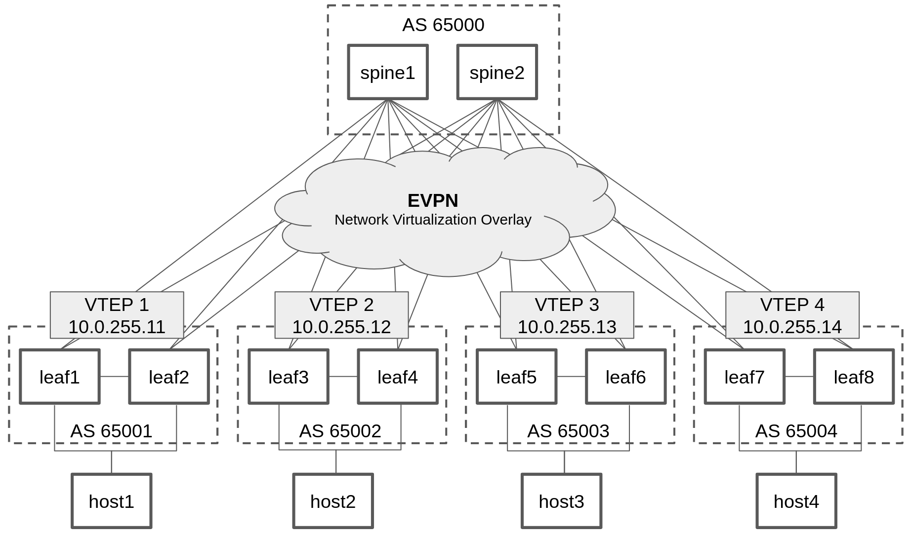

# Section 3: Applying best practices to build a BGP EVPN architecture
This is the last and final part of the workshop, in which you will get to apply all your knowledge to create a fully functioning BGP EVPN spine/leaf setup.

:exclamation: This is a free form excercise, so if you struggeled a little bit before, this may be an excercise you may want to do later on as you have built more experience.

If you want to read up on BGP EVPN based architectures, you can read David Varnum's excellent writup on the topic, here:
* [Arista BGP EVPN Overview and concepts](https://overlaid.net/2018/08/27/arista-bgp-evpn-overview-and-concepts/)

And this blog, where David Varnum step-by-step reviews a setup:
* [Arista BGP EVPN - Configuration example](https://overlaid.net/2019/01/27/arista-bgp-evpn-configuration-example/)

## Overview
```
3.1 Review of containerlab and desired state device configuration
3.2 Automating your network
3.3. Validating your setup
```

## 3.1 Review of containerlab and desired state device configuration
First off, what we want to accomplish, looks like this:



Leaf switches are organized in pairs of two, which are then connected to our spine switches. Connected to each leaf pair, we have a Linux system which is connected to both leaf switches. This Linux system has the typical Linux network troubleshooting tools re-installed.

For this lab, there are two already prepared containerlab files:
* $LABDIR/containerlab/lab3-start.yml
* $LABDIR/containerlab/lab3-full.yml

* The -start version will setup your starting point for automation, switches with only auth and a management interface setup, like we before in our labs.
* The -full version will setup everything fully configured, allowing you to explore the setup in details.

:boom: Task 1: Destroy the previous environment and setup our starting point by running below commands:
```
cd $LABDIR/containerlab
sudo containerlab --runtime podman destroy -t lab2.yml
sudo containerlab --runtime podman deploy -t lab3-start.yml
../scripts/ansible_hosts.sh lab3
```

---

:boom: Task 2: Review the desired state configuration of each and every switch by looking at their running configurations:
```
$ cd $LABDIR/containerlab/configs
$ ls *full*
leaf1-full.cfg	leaf2-full.cfg	leaf3-full.cfg	leaf4-full.cfg	leaf5-full.cfg	leaf6-full.cfg	leaf7-full.cfg	leaf8-full.cfg	spine1-full.cfg  spine2-full.cfg
$ more leaf11-full.cfg
$ more spine1-full.cfg
...
```

That is how your switches should look like when you are done.

## 3.2 Automating your network
Now it's time for you to decide on how you will use Ansible to accomplish a working version of the EVPN BPG architecture. The easiest way to accomplish this will be to use the arista.eos.eos_config module and push the working running configs to each switch. In real life, that is not always the best approach. Consider what parts of this network's configuration which you may be changing more often. Are there parts of the network configuration which you would rather manage separately? 

:boom: Task 1: Decide on how you will setup the network, create your Ansible automation and run it.
* :exclamation: If you end up in a dead end, you can always recreate the network by running the commands you ran to set it up first.
* :exclamation: To tips on validating the setup, see next section 3.3.

---

:boom: Task 2: Explore different approaches and consider how it would be to maintain this network more long term. As an example, if you push complete device configuration files initially, consider breaking off parts of it into separate plays, playbooks or even roles.  

## 3.3 Validating your setup

:boom: Show remote vteps

```
* leaf1#sh vxlan vtep
Remote VTEPS for Vxlan1:

VTEP              Tunnel Type(s)
----------------- --------------
10.0.255.12       unicast       
10.0.255.13       flood         
10.0.255.14       unicast       

Total number of remote VTEPS:  3
```

10.0.255.12 in above example is the Loopback1 address on leaf3 and leaf4 (VTEP 2):
```
leaf3>sh int Loopback1
Loopback1 is up, line protocol is up (connected)
  Hardware is Loopback
  Internet address is 10.0.255.12/32
  Broadcast address is 255.255.255.255
  IP MTU 65535 bytes (default)
  Up 1 hour, 37 minutes, 13 seconds
```

---

:boom: Show Type-5 EVPN routes which are the VRFs we are transporting across the EVPN fabric:
```
leaf1#show bgp evpn route-type ip-prefix ipv4
BGP routing table information for VRF default
Router identifier 10.0.250.11, local AS number 65001
Route status codes: * - valid, > - active, S - Stale, E - ECMP head, e - ECMP
                    c - Contributing to ECMP, % - Pending best path selection
Origin codes: i - IGP, e - EGP, ? - incomplete
AS Path Attributes: Or-ID - Originator ID, C-LST - Cluster List, LL Nexthop - Link Local Nexthop

          Network                Next Hop              Metric  LocPref Weight  Path
 * >Ec    RD: 10.0.250.13:1 ip-prefix 10.34.34.0/24
                                 10.0.255.12           -       100     0       65000 65002 i
 *  ec    RD: 10.0.250.13:1 ip-prefix 10.34.34.0/24
                                 10.0.255.12           -       100     0       65000 65002 i
 * >Ec    RD: 10.0.250.17:1 ip-prefix 10.78.78.0/24
                                 10.0.255.14           -       100     0       65000 65004 i
 *  ec    RD: 10.0.250.17:1 ip-prefix 10.78.78.0/24
                                 10.0.255.14           -       100     0       65000 65004 i
``` 

---

:boom: Connect to the Linux systems by using podman, such as:
```
$ sudo podman ps
CONTAINER ID  IMAGE                                   COMMAND               CREATED         STATUS                    PORTS       NAMES
569ae6a0a78f  localhost/ceos:4.32.0F                  bash -c /mnt/flas...  56 minutes ago  Up 56 minutes (starting)              clab-lab3-leaf5
faf3b1939ebc  localhost/ceos:4.32.0F                  bash -c /mnt/flas...  56 minutes ago  Up 56 minutes (starting)              clab-lab3-leaf1
aec63e3eeb99  localhost/ceos:4.32.0F                  bash -c /mnt/flas...  56 minutes ago  Up 56 minutes (starting)              clab-lab3-leaf2
3b958aaa2d44  localhost/ceos:4.32.0F                  bash -c /mnt/flas...  56 minutes ago  Up 56 minutes (starting)              clab-lab3-leaf8
a300aea9782e  localhost/ceos:4.32.0F                  bash -c /mnt/flas...  56 minutes ago  Up 56 minutes (starting)              clab-lab3-leaf4
893e798c2671  localhost/ceos:4.32.0F                  bash -c /mnt/flas...  56 minutes ago  Up 56 minutes (starting)              clab-lab3-leaf6
b6ddf7d3acf8  localhost/ceos:4.32.0F                  bash -c /mnt/flas...  56 minutes ago  Up 56 minutes (starting)              clab-lab3-spine1
742e9737c371  localhost/ceos:4.32.0F                  bash -c /mnt/flas...  56 minutes ago  Up 56 minutes (starting)              clab-lab3-spine2
a09acab104ae  localhost/ceos:4.32.0F                  bash -c /mnt/flas...  56 minutes ago  Up 56 minutes (starting)              clab-lab3-leaf7
805e0f444c0c  localhost/ceos:4.32.0F                  bash -c /mnt/flas...  56 minutes ago  Up 56 minutes (starting)              clab-lab3-leaf3
8d442ecef3e5  ghcr.io/hellt/network-multitool:latest  bash                  56 minutes ago  Up 56 minutes (starting)              clab-lab3-host4
e999c4e15ed4  ghcr.io/hellt/network-multitool:latest  bash                  56 minutes ago  Up 56 minutes (starting)              clab-lab3-host1
08c390e5909e  ghcr.io/hellt/network-multitool:latest  bash                  56 minutes ago  Up 56 minutes (starting)              clab-lab3-host2
6bddbf3fac1a  ghcr.io/hellt/network-multitool:latest  bash                  56 minutes ago  Up 56 minutes (starting)              clab-lab3-host3

$ sudo podman exec -it clab-lab3-host1 bash

bash-5.0# ping -c3 172.20.20.27
PING 172.20.20.27 (172.20.20.27) 56(84) bytes of data.
64 bytes from 172.20.20.27: icmp_seq=1 ttl=64 time=0.018 ms
64 bytes from 172.20.20.27: icmp_seq=2 ttl=64 time=0.041 ms
64 bytes from 172.20.20.27: icmp_seq=3 ttl=64 time=0.016 ms

--- 172.20.20.27 ping statistics ---
3 packets transmitted, 3 received, 0% packet loss, time 2058ms
rtt min/avg/max/mdev = 0.016/0.025/0.041/0.011 ms
bash-5.0# exit
exit
$
```

If you made it all the way here, what else is there to learn? Well, plenty ofcourse. But you are well on your way already to be able to call yourself an Ansible network automation specialist.

```
End-of-workshop
```
[Go back to the start](../../README.md)

